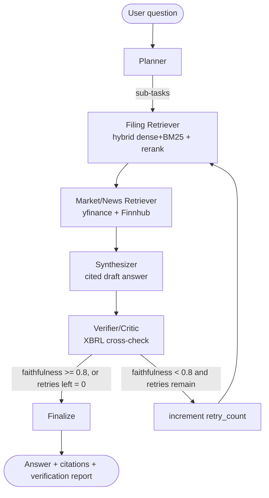

# Financial RAG — Multi-Agent SEC Filing Analysis

A production-grade, multi-agent RAG system that answers natural-language questions about
public companies by planning, retrieving SEC filings + market data, verifying every numeric
claim against structured XBRL ground truth, and synthesizing a cited answer.

Built as a portfolio project to demonstrate production-oriented AI engineering: an explicit,
inspectable agent state machine (LangGraph, not implicit chains), a real hybrid retrieval
stack over a persistent vector store, and — most importantly — an automated, quantitative
evaluation harness rather than ad-hoc testing.

## Why this exists

Most "RAG demo" projects stop at "it retrieves things and an LLM answers." The interesting
(and hard) part of shipping this kind of system is knowing whether the answers are actually
*correct*. This project treats that as the primary deliverable: every numeric claim the
system makes is programmatically cross-checked against SEC's machine-readable XBRL data,
and that check is both a live safety net (the Verifier agent can send the system back to
retrieval) and an offline metric (`python scripts/run_eval.py`).

---

## Architecture



**Agents** (`src/agents/`), each a LangGraph node reading/writing one shared `AgentState`:

| Agent | Responsibility |
|---|---|
| **Planner** | Decomposes the question into typed sub-tasks (numeric lookup, comparison, qualitative, multi-company), deciding which need filing text vs. market data. |
| **Filing Retriever** | Hybrid search (dense embeddings + BM25, fused via reciprocal rank fusion, cross-encoder reranked) over chunked SEC filings in Qdrant. |
| **Market/News Retriever** | Pulls recent news (Finnhub) and price/fundamentals (yfinance) for context. |
| **Synthesizer** | Drafts a cited answer using only the retrieved evidence. |
| **Verifier/Critic** | Extracts every numeric claim from the draft, cross-checks it against SEC XBRL structured data, and either passes the answer through or routes back to retrieval with specific hints about what to fix. |

The verifier's conditional edge is the one piece of real agentic control flow in the graph:
a failed verification with retry budget remaining re-enters `filing_retriever` (not the
planner — the sub-tasks are still valid, only the evidence needs to improve), carrying
`retry_hints` that target the retrieval query at the specific gap the verifier found.

**Shared state schema** (`src/agents/state.py`) — a single `TypedDict` passed through every
node, with `operator.add`-reduced fields (`filing_chunks`, `trace`, `errors`) so the retry
loop accumulates evidence instead of overwriting it.

---

## Data universe

18 large-cap tickers across 3 sectors, chosen for clean, consistently-tagged XBRL data and
reliable coverage across EDGAR, yfinance, and Finnhub's free tier:

| Sector | Tickers |
|---|---|
| Technology | AAPL, MSFT, GOOGL, NVDA, META, CRM |
| Finance | JPM, BAC, GS, MS, WFC, V |
| Healthcare | JNJ, UNH, PFE, MRK, ABBV, LLY |

Defined in `src/data/universe.py`.

## Zero-cost data sources

- **SEC EDGAR** (`data.sec.gov/submissions`, `www.sec.gov/Archives`) — 10-K/10-Q filing text. No key; rate-limited client-side to stay under SEC's fair-use cap, with a descriptive `User-Agent`.
- **SEC EDGAR XBRL** (`data.sec.gov/api/xbrl/`) — structured ground-truth financials (revenue, net income, EPS, etc.) used by the verifier and the eval harness's faithfulness metric.
- **yfinance** — price/fundamentals. No key.
- **Finnhub free tier** — company news. Requires a free email-signup API key (`FINNHUB_API_KEY`), no card.

No paid LLM-adjacent APIs are required for retrieval — the only billed API surface is the
Gemini model used for planning/synthesis/verification (`GOOGLE_API_KEY`), and Gemini's free
tier covers light use of this project's default model.

---

## Retrieval design

- **Section-aware chunking** (`src/retrieval/chunking.py`): filings are split on `Item N`
  headers first (Item 1A Risk Factors, Item 7 MD&A, etc.), then any section too long for a
  single chunk is sub-split on paragraph boundaries with token overlap — not a naive
  fixed-size sliding window blind to filing structure.
- **Persistent vector store**: Qdrant (self-hosted via docker-compose), storing chunk text
  alongside company/filing-type/date/section metadata used for both retrieval filtering and
  citation.
- **Hybrid search**: dense (local `sentence-transformers` embeddings) + sparse (BM25) fused
  via reciprocal rank fusion, then reranked with a cross-encoder — not dense-only.
- **Citations**: every retrieved chunk carries its source metadata through synthesis into
  the final answer's citation list.

---

## Evaluation layer

This is the part of the project meant to be defensible in an interview, not an afterthought.

1. **Eval set** — `data/eval_set.json`, 30 hand-written questions spanning numeric lookup,
   QoQ/YoY comparison, qualitative ("why did X change"), and multi-company comparison, each
   with structured expected-answer characteristics (not exact strings): an XBRL metric +
   period + tolerance for numeric questions, or required concepts for qualitative ones.
2. **Faithfulness (headline metric)** — `src/eval/faithfulness.py`. Every numeric claim in
   a generated answer is extracted by the LLM into a structured `(metric, value, unit,
   company, period)` tuple, then cross-checked against the matching SEC XBRL fact. The
   headline number is `confirmed claims / total claims`, pooled across the whole eval run —
   this is the same code path used live by the Verifier agent, so "verified in eval" and
   "verified in production" are identical logic.
3. **Retrieval precision** — `src/eval/retrieval_precision.py` + `data/retrieval_labels.json`,
   a small hand-labeled set of (question → acceptable filing-type/section) pairs, checked
   against what the hybrid retriever actually returns.
4. **Latency & cost** — `src/eval/latency.py` breaks down per-query latency by agent step
   (from the `trace` field every node writes to) and estimates LLM token cost from logged
   Gemini usage.
5. **Report** — regenerate everything with:

   ```bash
   python scripts/run_eval.py
   ```

   This writes `eval_report.md` (also servable via `GET /eval-report`) and prints it to
   stdout. Run this yourself with a configured `GOOGLE_API_KEY` and an ingested corpus —
   results depend on your ingested filings and will vary by model/config, so no fixed
   numbers are hardcoded here. A full 30-question run at the default `gemini-2.5-flash`
   model costs well under $1 (likely free, within Gemini's free-tier quota).

---

## Project structure

```
src/
  agents/       LangGraph state schema + each agent node + graph wiring
  retrieval/    chunking, embeddings, Qdrant vector store, BM25, hybrid search, reranker
  data/         SEC EDGAR / XBRL / yfinance / Finnhub clients, universe config, ingestion
  eval/         eval set loader, faithfulness metric, retrieval precision, latency, report
  api/          FastAPI app, routes, schemas
frontend/       Streamlit UI
tests/          pytest suite (chunking, retrieval, XBRL parsing, verifier, EDGAR client)
scripts/        ingest_universe.py, run_eval.py
data/           eval_set.json, retrieval_labels.json (checked in); raw/ (gitignored cache)
docker/         Dockerfile.api, Dockerfile.frontend
```

---

## Setup

### 1. Configure environment

```bash
cp .env.example .env
# then edit .env:
#   GOOGLE_API_KEY=...             (required — free key at aistudio.google.com/apikey)
#   FINNHUB_API_KEY=...            (optional — free signup at finnhub.io; news is skipped without it)
#   SEC_USER_AGENT="your project you@email.com"   (required by SEC — identify yourself)
```

### 2. Run with Docker Compose (recommended)

```bash
docker compose up --build
```

This starts Qdrant (`localhost:6333`), the API (`localhost:8000`), and the Streamlit UI
(`localhost:8501`).

### 3. Or run locally

```bash
python -m venv .venv && source .venv/bin/activate
pip install -e ".[dev]"

# Qdrant needs to be running somewhere reachable at QDRANT_URL — easiest is:
docker run -p 6333:6333 qdrant/qdrant:v1.12.4

# Ingest filings for the company universe (downloads from EDGAR, chunks, embeds, upserts)
python scripts/ingest_universe.py --filings-per-form 1

# Start the API
uvicorn src.api.main:app --reload

# In another terminal, start the UI
streamlit run frontend/app.py
```

### 4. Run the eval suite

```bash
python scripts/run_eval.py            # full 30-question set
python scripts/run_eval.py --limit 5  # quick smoke run
```

### 5. Run tests

```bash
pytest tests/ -v
ruff check .
mypy src/   # advisory in CI — see .github/workflows/ci.yml
```

---

## Example queries

- "How did Apple's gross margin change last quarter and why?"
- "Compare JPMorgan Chase and Bank of America's net income year-over-year."
- "What risk factors did NVIDIA highlight in its most recent 10-K?"
- "What was Pfizer's R&D expense in its latest 10-Q?"

## API

```
POST /query
{
  "question": "How did Apple's gross margin change last quarter and why?",
  "companies": ["AAPL"],
  "max_retries": 2
}
```

Returns the final answer, citations, per-claim verification results, faithfulness score,
full agent trace (per-step latency), and any non-fatal errors encountered.

```
GET /eval-report   # markdown from the last `python scripts/run_eval.py` run
GET /health
```

---

## Design notes / known limitations

- The BM25 index is rebuilt from Qdrant's stored payloads on every hybrid search call rather
  than persisted separately. At this project's scale (a handful of filings per company) this
  is fast enough (~ms) and avoids keeping two indexes in sync; it would need to change for a
  much larger corpus.
- Numeric-claim → XBRL period matching (`src/eval/faithfulness.py::_match_period`) is a
  best-effort regex match on quarter/year mentions in the model's stated period, falling
  back to the most recently filed fact. It's intentionally generous (a 2% tolerance band) to
  absorb rounding without masking real errors — tune `CONFIRMED_TOLERANCE_PCT` if needed.
  Errors here show up directly in the retrieval precision / faithfulness metrics.
- Rate limiting for EDGAR is a simple client-side token bucket (`src/data/edgar_client.py`)
  tuned conservatively under SEC's 10 req/sec fair-use cap.
